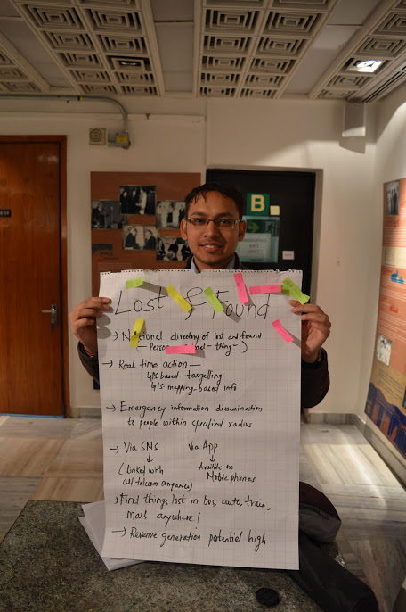

# swdel-lost-and-found-twitter-bot
Twitter bot made at Startup Weekend Delhi Feb 2016 that matches people who have lost and found things using NLTK + Tweepy

Another component was a twitter live stream reader that feeds into our database from twitter. 

##Idea

1. Ubiquitous Database for lost and found things including items, people etc.
2. Information retrieved in realtime using various sources, eg twitter, whatsapp, etc.
3. Connect people with matching descriptions so they can discuss. Also notify people nearby if location data was available.
4. Revenue generated using donations and grants, along with optional matchmaking fee if user used our app or website if user liked the service. Premium services like live-chat and push-notifications.

##Team

##Photos
###Idea

###Team Working

###Pitch and Live Demo

###Team with the Facilitators
